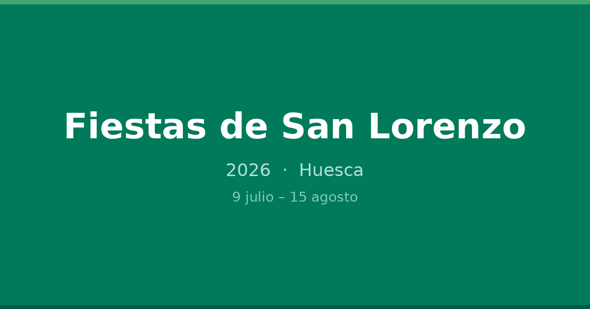

<p align="center">
  
</p>

<h1 align="center">🎉 Fiestas de San Lorenzo 2026</h1>

<p align="center">
  Agenda digital de las Fiestas de San Lorenzo 2026 — Huesca<br/>
  <a href="https://fiestassanlorenzo.javierpalacio.es">fiestassanlorenzo.javierpalacio.es</a>
</p>

<p align="center">
  
  
  
  
  
</p>

---

## ¿Qué es?

Web app para consultar el programa completo de las Fiestas de San Lorenzo 2026 de Huesca (9 agosto – 15 agosto). Diseñada para usar en el móvil durante las fiestas: rápida, offline-ready e instalable como app.

**¿Por qué?** El programa oficial solo está en PDF. Esta web lo hace navegable, buscable y con funcionalidades que el PDF no ofrece.

## Funcionalidades

- **Programa por días** — Timeline visual con eventos de mañana, tarde y noche
- **Buscador** — Búsqueda en tiempo real por título, lugar, categoría
- **Favoritos** — Marca eventos con ★ y accede rápido a ellos
- **Mapa interactivo** — Leaflet con zonas, eventos y tu ubicación
- **Cercanos a ti** — Geolocalización para ver eventos a menos de 5 km
- **Notificaciones** — Recordatorio 15 min antes de un evento favorito
- **Filtros** — Por categoría (música, taurino, religioso, tradicional...) y zona
- **PWA** — Instalable como app en iOS/Android, funciona offline
- **Conciertos** — Sección dedicada con agrupación por venue

## Capturas

| Landing | Día | Mapa |
|---------|-----|------|
| Hero con fases, timeline y días | Timeline con eventos por momento | Mapa fullscreen con zonas y filtros |

## Stack

| Tecnología | Uso |
|-----------|-----|
| [Next.js 16](https://nextjs.org) | Framework (App Router, Turbopack) |
| [TypeScript](https://www.typescriptlang.org) | Tipado estático |
| [Tailwind CSS 4](https://tailwindcss.com) | Estilos |
| [Leaflet](https://leafletjs.com) | Mapa interactivo |
| [next-pwa](https://github.com/shadowwalker/next-pwa) | Service worker y PWA |
| [Playwright](https://playwright.dev) | Tests E2E |

## Datos

- 230+ eventos extraídos de [fiestassanlorenzo.es](https://www.fiestassanlorenzo.es/programa)
- Hardcodeados en `src/data/eventos.ts` (sin backend)
- 15 zonas geolocalizadas en `src/data/zonas.ts`
- Favoritos y notificaciones vía `localStorage`

## Estructura

```
src/
├── app/
│   ├── layout.tsx              # Layout raíz, metadata, PWA
│   ├── page.tsx                # Landing: hero, timeline, días
│   ├── dia/[dia]/page.tsx      # Programa del día (SSG)
│   ├── conciertos/page.tsx     # Conciertos por venue
│   ├── favoritos/page.tsx      # Mis favoritos
│   └── mapa/page.tsx           # Mapa fullscreen
├── components/
│   ├── BottomNav.tsx           # Navegación flotante
│   ├── EventoCard.tsx          # Tarjeta de evento
│   ├── BuscadorEventos.tsx     # Búsqueda en tiempo real
│   ├── EventosCercanos.tsx     # Geolocalización
│   ├── FiltroCategorias.tsx    # Filtros por categoría
│   └── MapaLeaflet.tsx         # Mapa con Leaflet
├── data/
│   ├── eventos.ts              # 230+ eventos
│   └── zonas.ts                # 15 zonas geolocalizadas
├── lib/
│   ├── favoritos.ts            # Favoritos (localStorage)
│   └── notificaciones.ts      # Push notifications
└── types/
    └── evento.ts               # Tipos TypeScript
```

## Instalación

```bash
git clone https://github.com/javipaur/sanLorenzoApp.git
cd sanLorenzoApp
npm install
npm run dev
```

Abre [http://localhost:3000](http://localhost:3000).

## Comandos

```bash
npm run dev        # Servidor de desarrollo
npm run build      # Build de producción
npm run start      # Servidor de producción
npm run lint       # ESLint
npm run typecheck  # tsc --noEmit
npm run test       # Playwright E2E tests
```

## Despliegue

El proyecto está desplegado en [Dokploy](https://dokploy.com). Usa `nixpacks.toml` para forzar Node.js 20.

```bash
# Requiere Node.js >= 20.9.0
npm run build && npm run start
```

## Iconografía

Los iconos PWA y el favicon están generados a partir del cartel oficial de las Fiestas de San Lorenzo 2026.

## Licencia

MIT — Usa libremente para tu proyecto de fiestas.

---

<p align="center">
  Hecho con ❤️ en Huesca
</p>
